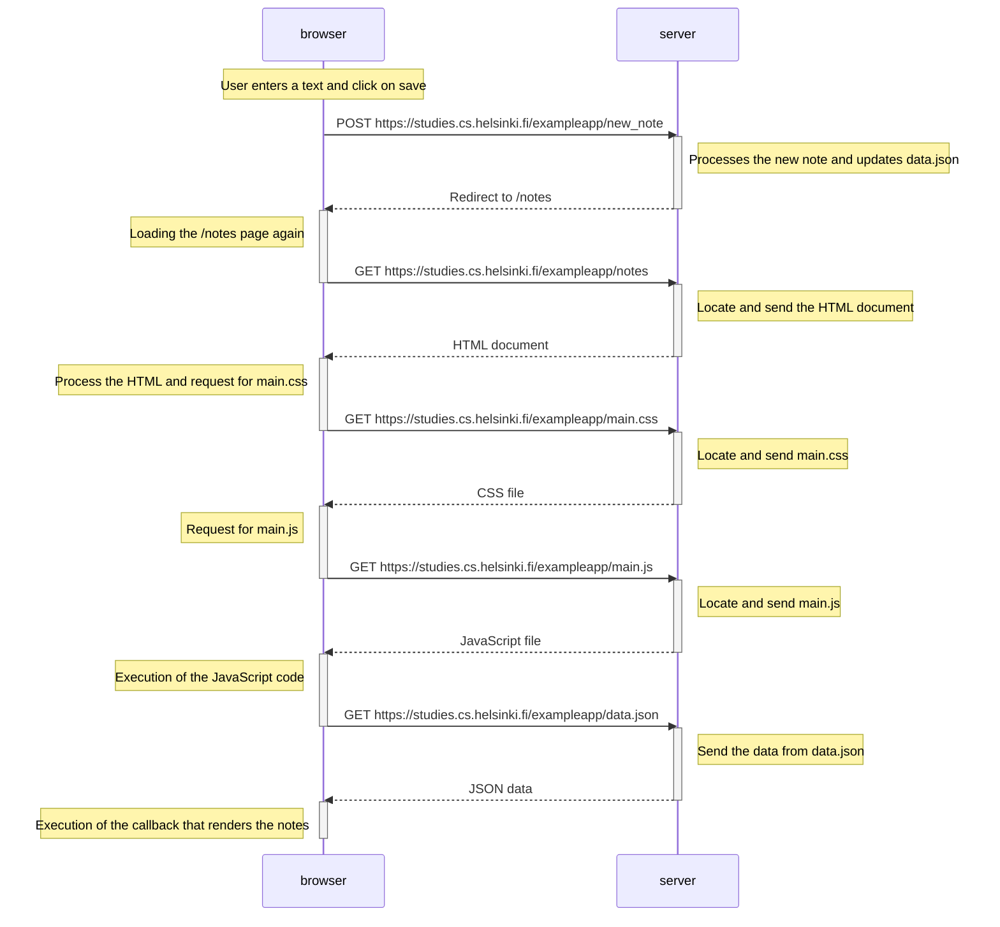

```mermaid
sequenceDiagram
    participant browser
    participant server

    Note over browser: User enters a text and click on save
    browser->>server: POST https://studies.cs.helsinki.fi/exampleapp/new_note
    activate server
    Note right of server: Processes the new note and updates data.json
    server-->>browser: Redirect to /notes
    deactivate server

    activate browser
    Note left of browser: Loading the /notes page again
    browser->>server: GET https://studies.cs.helsinki.fi/exampleapp/notes
    deactivate browser

    activate server
    Note right of server: Locate and send the HTML document
    server-->>browser: HTML document
    deactivate server

    activate browser
    Note left of browser: Process the HTML and request for main.css
    browser->>server: GET https://studies.cs.helsinki.fi/exampleapp/main.css
    deactivate browser

    activate server
    Note right of server: Locate and send main.css
    server-->>browser: CSS file
    deactivate server

    activate browser
    Note left of browser: Request for main.js
    browser->>server: GET https://studies.cs.helsinki.fi/exampleapp/main.js
    deactivate browser

    activate server
    Note right of server: Locate and send main.js
    server-->>browser: JavaScript file
    deactivate server

    activate browser
    Note left of browser: Execution of the JavaScript code
    browser->>server: GET https://studies.cs.helsinki.fi/exampleapp/data.json
    deactivate browser

    activate server
    Note right of server: Send the data from data.json
    server-->>browser: JSON data
    deactivate server

    activate browser
    Note left of browser: Execution of the callback that renders the notes
    deactivate browser

```