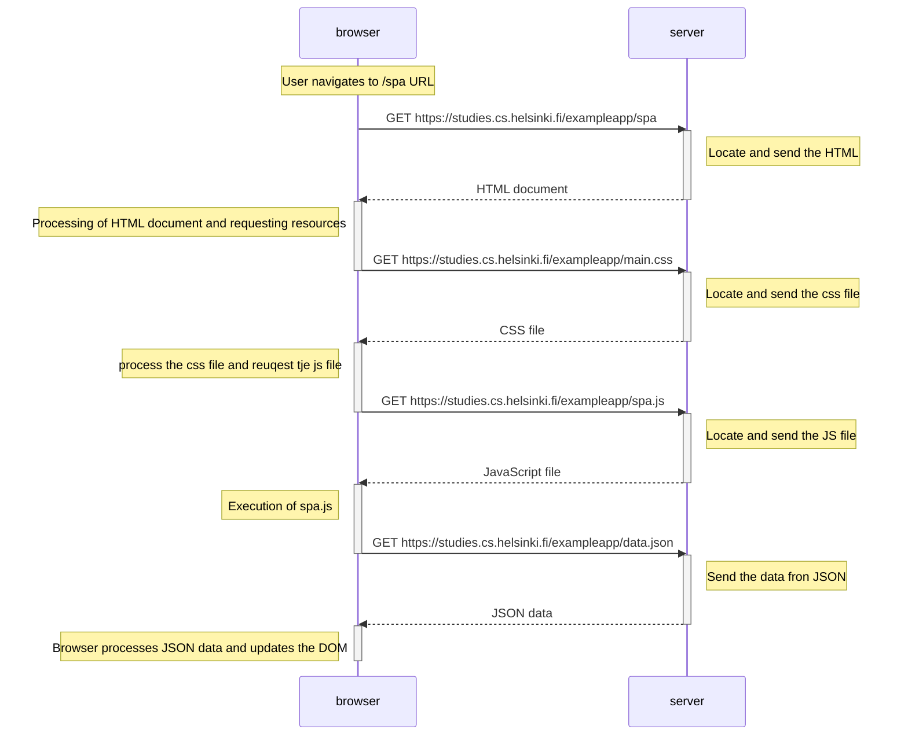

```mermaid
sequenceDiagram
    participant browser
    participant server

    Note over browser: User navigates to /spa URL
    browser->>server: GET https://studies.cs.helsinki.fi/exampleapp/spa
    activate server
    Note right of server: Locate and send the HTML
    server-->>browser: HTML document
    deactivate server

    activate browser
    Note left of browser: Processing of HTML document and requesting resources
    browser->>server: GET https://studies.cs.helsinki.fi/exampleapp/main.css
    deactivate browser

    activate server
    Note right of server: Locate and send the css file
    server-->>browser: CSS file
    deactivate server

    activate browser
    Note left of browser: process the css file and reuqest tje js file
    browser->>server: GET https://studies.cs.helsinki.fi/exampleapp/spa.js
    deactivate browser

    activate server
    Note right of server: Locate and send the JS file
    server-->>browser: JavaScript file
    deactivate server

    activate browser
    Note left of browser: Execution of spa.js
    browser->>server: GET https://studies.cs.helsinki.fi/exampleapp/data.json
    deactivate browser

    activate server
    Note right of server: Send the data fron JSON
    server-->>browser: JSON data
    deactivate server

    activate browser
    Note left of browser: Browser processes JSON data and updates the DOM
    deactivate browser

```