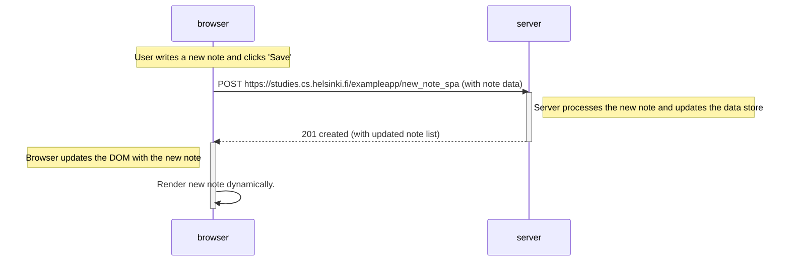

```mermaid
sequenceDiagram
    participant browser
    participant server

    Note over browser: User writes a new note and clicks 'Save'
    browser->>server: POST https://studies.cs.helsinki.fi/exampleapp/new_note_spa (with note data)
    activate server
    Note right of server: Server processes the new note and updates the data store
    server-->>browser: 201 created (with updated note list)
    deactivate server

    activate browser
    Note left of browser: Browser updates the DOM with the new note
    browser->>browser: Render new note dynamically.
    deactivate browser

```